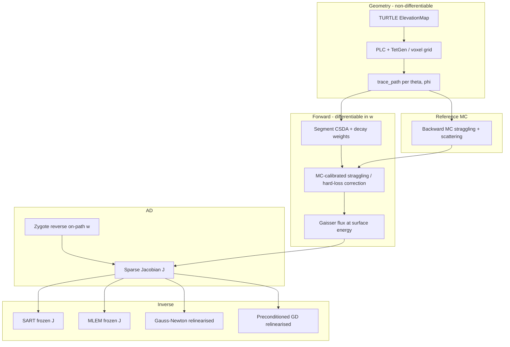

# LVD Tomography with Differentiable Muon Transport

This document describes the **Gran Sasso LVD** absorption-muography example (`examples/lvd_tomography.jl`), built on **DiffPumas.jl**. It connects the full physics stack—PUMAS-style transport (CSDA, straggling, scattering, mixtures), **TURTLE** topography, straight-line **ray tracing** through a tessellated sensitivity volume, **automatic differentiation (AD)** of a calibrated CSDA forward model, and several **inverse** solvers—into a single workflow validated against stochastic Monte Carlo (MC) and, optionally, measured LVD intensity maps.

For the general differentiable transport theory, see [diff_flux.md](diff_flux.md). For PUMAS / backward MC / TURTLE background, see [pumas_library.md](pumas_library.md). For detection statistics, see [muon_tomography_information_theory.md](muon_tomography_information_theory.md).

---

## 1. Scientific goal and modality

**Laboratorio del Gran Sasso (LVD)** sits deep underground. Cosmic-ray muons arrive from many directions; their **integrated flux** (or rate) in angular bins depends on how much rock, water, and air they traverse. This example treats **transmission / absorption muography**:

- **Observable:** directional muon flux \(\Phi_m\) at the detector (one bin per \((\theta,\phi)\) pair).
- **Unknown:** per-cell **rock/water proportion** \(w_i\) (and optionally **dense rock** via \(w_i < 0\)) in a local 3D volume above the detector.

This is **not** scattering tomography (μTRec, mPoCA): those methods need per-muon incoming/outgoing tracks and multiple-Coulomb-scattering angles. Here we use flux attenuation only—the same family as algebraic (SART) and statistical (MLEM / MAP) methods surveyed in `docs/muon_tomography_methods.md`.

The script compares:

1. **Direct CSDA + Zygote** — fast, differentiable forward model and sparse Jacobian.
2. **Full backward MC** — straggling, DEL, EHS, soft MCS (PUMAS-matched), for calibration and “ground truth” observations.
3. **Inverse solvers** — SART, MLEM, preconditioned gradient descent (GD), and Gauss–Newton (GN) on the nonlinear corrected-CSDA operator.

---

## 2. Muon transport physics (summary)

The implementation follows the PUMAS C library and is documented in detail in [diff_flux.md](diff_flux.md). The quantities below are what the LVD example actually uses.

### 2.1 Atmospheric primary flux

At the **primary altitude** \(H\) (default 30 km above the detector), the surface spectrum uses the modified **Gaisser** formula (GCCLY implementation):

\[
\frac{d\Phi}{dE\,d\Omega} = \frac{0.14\,E^{-2.7}}{\mathrm{cm}^2\,\mathrm{s}\,\mathrm{sr}\,\mathrm{GeV}}
\left(
\frac{1}{1 + 1.1 E \cos\theta^*/115\,\mathrm{GeV}}
+
\frac{0.054}{1 + 1.1 E \cos\theta^*/850\,\mathrm{GeV}}
\right),
\]

with effective zenith \(\theta^*\) for Earth curvature. Charge \(\mu^\pm\) is sampled with ratio \(R \approx 1.2766\).

### 2.2 Energy loss and transport modes

Total stopping power (CSDA):

\[
-\frac{dE}{dX} = a(E) + b(E)\,E,
\]

with ionization \(a\) and radiative \(b E\) terms from PUMAS tables.

**Backward Monte Carlo** starts at the detector with final energy \(K_f\), zenith \(\theta\), azimuth \(\phi\), and propagates **backward** (increasing energy), accumulating:

- **Jacobian weight** \(w \propto |dE/dX|_{K_i}/|dE/dX|_{K_f}\) per step (phase-space factor).
- **Decay survival** \(\exp(-L/(\beta\gamma c\tau_0))\).

**Dual mode** (as in `flux_comparison.jl` and LVD MC):

| Energy | Energy loss | Scattering |
|--------|-------------|------------|
| \(K < K_{\mathrm{th}}\) (default 100 GeV) | STRAGGLED + straggling variance | MIXED MCS + DEL/EHS when enabled |
| \(K \ge K_{\mathrm{th}}\) | MIXED (soft radiative part resolved) | Disabled |

Below threshold: **Vavilov**-style straggling and **discrete energy loss (DEL)** (bremsstrahlung, pair production, photonuclear) with angular deflection when scattering is on. **Elastic hard scattering (EHS)** competes with DEL by shorter interaction grammage.

**Multiple Coulomb scattering (MCS):** soft deflections from the first transport mean free path \(\lambda_1\):

\[
\frac{1}{\lambda_1} = \frac{1}{\lambda_1^{\mathrm{el}}} + \frac{1}{\lambda_1^{\mathrm{rad}}} + \frac{1}{\lambda_1^{\mathrm{e}}}.
\]

Per step, \(\bar\mu = \tfrac{1}{4}\ell(\lambda_1^{-1,\mathrm{start}}+\lambda_1^{-1,\mathrm{end}})\); sample \(\mu = -\bar\mu\ln U\) with rejection if \(\mu>1\).

### 2.3 Materials: composites and runtime mixtures

**Composites** (MDF XML, e.g. `PorousWetRock`): precomputed tables with

\[
\left(\frac{dE}{dX}\right)_{\mathrm{comp}} = \sum_j f_j \left(\frac{dE}{dX}\right)_j,\qquad
\rho_{\mathrm{comp}} = \frac{\sum_j f_j}{\sum_j f_j/\rho_j}.
\]

**Runtime mixtures** (`MaterialMixture`): same weighted stopping power and straggling; harmonic mean for MCS:

\[
\frac{1}{\lambda_{1,\mathrm{mix}}} = \sum_i \frac{f_i}{\lambda_{1,i}}.
\]

DEL/EHS: \(\sigma_{\mathrm{mix}} = \sum_i f_i \sigma_i\), then sample which component interacted.

In LVD tomography, each cell’s physics is a **rock/water mixture** parametrised by \(w_i\) (see §5).

### 2.4 Direct CSDA (differentiable forward)

For inversion, the iterative MC path is replaced by **segment-wise CSDA** on **precomputed straight-ray paths** (geometry fixed; physics differentiable in \(w\)).

For grammage \(\Delta X\) backward through matter, invert the range table:

\[
R(K_i) = R(K_f) + \Delta X,\qquad
w_{\mathrm{step}} = \frac{|dE/dX|_{K_{i+1}}}{|dE/dX|_{K_i}} \cdot P_{\mathrm{decay}}.
\]

Total flux for a bin averages over log-uniform energy samples at the detector, multiplies accumulated weights and **Gaisser** flux at the surface energy, and applies charge sampling factor 2.

Zygote differentiates through **table interpolation** and explicit \(w\)-dependent density/stopping power—not through discrete ray–cell choices.

---

## 3. Site geometry: LVD, TURTLE, and the sensitivity volume

### 3.1 Topography and detector frame

The example **includes** `examples/lvd_muography.jl` as module `LVDTopo`:

- Builds an **`ElevationMap`** from LVD / Gran Sasso topography (TURTLE: bilinear DEM, WGS84, projections).
- Detector at **`DETECTOR_ELEVATION`** m ASL; local coordinates: **\(z=0\)** at the detector, **\(z\)** upward in metres, **\(x\)** east, **\(y\)** north.

**TURTLE** (`src/Turtle.jl`) provides:

- `map_elevation(emap, x_km, y_km)` — surface height above detector frame.
- Optimistic stepping for long-range atmospheric paths (used in broader muography examples).

For each direction \(\hat{d}(\theta,\phi)\), **`ray_surface_exit_distance`** marches along the ray in 40 m steps, bisects where \(z\) crosses the surface, and returns rock path length \(R_{\mathrm{rock}}\) to the air interface and exit height \(z_{\mathrm{exit}}\).

### 3.2 Angular grid

Default (full demo):

- Zenith: \(\theta \in \{0,1,\ldots,59\}\)° (from vertical).
- Azimuth: \(\phi \in \{0,1,\ldots,359\}\)°.

That yields up to **21 600** directional bins; each gets one **`DirectionalPath`**.

### 3.3 Tetrahedral mesh (primary geometry)

```
                    Surface z = h(x,y)  (from DEM)
    ═══════════════════════════════════════════════════════
                         │  Tetrahedral cells
                         │  (TetGen PLC)
                         │
    ─────────────────────●──────────────────  z = 0  (LVD detector)
```

1. **`build_surface_grid`**: sample topography on a regular \((x,y)\) grid (`--surface-step-km`, `--mesh-half-km`).
2. **`create_topography_plc`**: piecewise-linear complex (PLC)—top surface triangulation + flat bottom at \(z=0\) + side walls → closed volume.
3. **TetGen** tetrahedralizes with `--tet-max-volume` (m³).
4. **Face neighbours** link tetrahedra across internal faces for ray walking.

**`trace_path` (tetra):** from \(\epsilon\) along \(\hat{d}\), find containing tet, step to nearest face intersection, record **`CellSegment(tet_idx, distance)`**, jump to neighbour tet, until surface distance is consumed. Remaining distance in uniform **standard rock** is `remaining_rock_distance`.

### 3.4 Voxel fallback (`--geometry grid`)

Structured grid with `--grid-nz` vertical layers; same ray logic with axis-aligned cell boundaries (`distance_to_voxel_boundary`).

### 3.5 Air column

After rock, backward CSDA continues through **exponential air** from \(z_{\mathrm{exit}}\) to primary altitude \(H\):

\[
\rho_{\mathrm{air}}(z) = \rho_0 \exp(-z/h_s),\quad h_s \approx 12\,\mathrm{km}.
\]

`SiteConfig(detector_elevation, primary_altitude)` sets ASL for density evaluation.

---

## 4. Forward model in `DiffPumas.Tomography`

Core code: `src/Tomography.jl`, `src/Tomography_inverse.jl`. The example wires geometry; the module owns physics + inversion.

### 4.1 Per-cell material parameter \(w\)

Signed mixture (continuous at \(w=0\)):

| \(w\) | Interpretation | Effective density |
|--------|----------------|-------------------|
| \(w \ge 0\) | Water fraction | \((1-w)\rho_{\mathrm{rock}} + w\rho_{\mathrm{water}}\) |
| \(w < 0\) | Dense-rock fraction \(d=-w\) | \((1-d)\rho_{\mathrm{rock}} + d\rho_{\mathrm{dense}}\) |

Shallow cells (within `--porous-top` m of surface) may use **porous wet rock** composite: 50% porous + 50% rock + water fraction \(w\).

Stopping power for AD (no `MaterialMixture` allocation):

\[
\left(\frac{dE}{dX}\right)_i(w) = (1-w)\,\mathrm{SP}_{\mathrm{rock}} + w\,\mathrm{SP}_{\mathrm{water}}
\]

(analogous in porous/dense branches). This matches mass-fraction-weighted mixture tables.

### 4.2 Segment propagation

Each rock segment uses sub-steps with:

- Max relative energy gain `CSDA_MAX_RELATIVE_GAIN = 0.02` per step.
- Max geometric step `CSDA_MAX_STEP_M = 60` m.
- Trapezoidal \(dE/dX\) and decay weight (same structure as uniform-rock and air segments).

For one energy sample, along path segments the code accumulates:

\[
V = \int \Omega(E)\,dX,\qquad
H = \int \bigl(\mathrm{dedx}_{\mathrm{CSDA}} - \mathrm{dedx}_{\mathrm{MIXED}}\bigr)\,dX
\]

(rock straggling variance \(\Omega\) and **hard-loss** deficit), then applies **MC-calibrated correction** (§4.3).

Directional flux:

\[
\Phi(\mathbf{w}) = G(\theta)\cdot \frac{1}{N}\sum_{k=1}^{N} 2\,w_k^{\mathrm{sample}}\,
\Bigl[\prod_{\mathrm{steps}} w_{\mathrm{step}}\Bigr]\,
\exp\!\Bigl(-\kappa_s V/E_s^2 - \kappa_h H/E_s\Bigr)\,
\Phi_{\mathrm{Gaisser}}(\cos\theta, E_s, q),
\]

times optional geometric residual multiplier \(\exp(a + b\log L + c\log^2 L + d\cos\theta)\) with \(L\) = total rock path length.

### 4.3 Calibration: matching CSDA to full MC

Pure CSDA **overpredicts** deep flux (~40% at Gran Sasso scales) because mean \(dE/dX\) ignores straggling and catastrophic radiative losses that raise required surface energy on a steep spectrum.

**`calibrate_correction_to_mc`** (before Jacobian assembly):

1. Pick stratified zenith bins (`--calibration-bins`).
2. Run **high-statistics** `compute_directional_flux_mc` (straggling + scattering, `--calibration-mc-samples`).
3. Grid-search \((\kappa_s,\kappa_h)\) to minimise mean squared \(\log(\Phi_{\mathrm{CSDA}}/\Phi_{\mathrm{MC}})^2\).
4. Fit residual polynomial in \(\log L\) and \(\cos\theta\).
5. Install via `set_csda_correction!`.

Because correction depends on \(w\) through \(\rho\), \(\Omega\), and stopping powers, **Zygote propagates gradients through \(\kappa\)** automatically.

Disable with `--no-correction` for pure-CSDA studies.

### 4.4 Sparse Jacobian

For bin \(b\), only cells on the ray matter. **`directional_flux_and_grad_csda`**:

1. Build on-path index list `path_cells`.
2. `Zygote.withgradient` on `_directional_flux_core` w.r.t. `wsel` only.
3. Assemble `J[b, i] = \partial\Phi_b/\partial w_i`.

**`assemble_forward_and_jacobian`**: threaded over bins → `SparseMatrixCSC` of size `(n_{\mathrm{bins}}, n_{\mathrm{cells}})`.

Typical sparsity: each bin touches \(\mathcal{O}(10\text{–}100)\) cells, not the full mesh.

### 4.5 MC forward (validation and observations)

**`compute_directional_flux_mc`**: backward steps with `transport_backward_step_full` / `transport_backward_step_mixed`, `MaterialMixture` per cell from `build_cell_properties_for_mc`.

Used for:

- **FD validation** (`run_validation_cases`): compare \(\partial\Phi/\partial w\) from AD vs MC finite difference on selected \((\mathrm{bin},\mathrm{cell})\) pairs.
- **Inverse observations** (`--inverse-data mc`): avoid inverse crime; Poisson/Gaussian noise on MC flux, not CSDA truth.
- **Paper-match uncertainty** (`nmap_result_for` + `estimate_transport_uncertainty`).

Parameters align with **`flux_comparison.jl`**: `--threshold`, `--no-straggling`, `--no-scattering`, threshold scan for systematic bands.

---

## 5. Inverse problem

### 5.1 Linearised absorption formulation

At baseline \(\mathbf{w}=\mathbf{0}\), let \(\Phi_0\) be corrected-CSDA flux and \(J = \partial\Phi/\partial\mathbf{w}\) the sparse Jacobian.

Adding water **lowers** density → **more** muons → flux **excess**:

\[
\mathbf{b} = \boldsymbol{\Phi}_{\mathrm{obs}} - \boldsymbol{\Phi}_0 \approx J\,\mathbf{w}.
\]

**SART** solves \(\mathbf{b} \approx J\mathbf{w}\) with row/column normalization and optional Laplacian smoothing.

**MLEM** (Poisson EM on nonnegative system): use **`max.(J,0)`** and **`max.(b,0)`** so multiplicative updates remain valid.

Both use a **frozen** Jacobian at \(\mathbf{w}=0\) (single linearisation).

### 5.2 Nonlinear AD solvers (relinearised each iteration)

**`make_csda_operator`** returns `model(w) -> (pred, J)` with full forward + Jacobian on valid bins.

**Gauss–Newton / Levenberg–Marquardt** (`gauss_newton_reconstruct`):

Minimise \(\tfrac{1}{2}\|\mathbf{W}^{1/2}(\mathrm{pred}(\mathbf{w})-\mathbf{obs})\|^2 + R(\mathbf{w})\).

Each iteration: solve \((J^\top W J + H_R + \mu\,\mathrm{diag})\,\delta = -J^\top W \mathbf{r} - \nabla R\), backtrack, clamp to box.

**Preconditioned projected GD** (`gradient_descent_reconstruct`, `optimizer=:pgd`):

\(\nabla = J^\top W(\mathrm{pred}-\mathbf{obs}) + \nabla R\); Jacobi scale by \(\mathrm{diag}(J^\top W J + H_R)\); optimal quadratic step length capped by `--gd-lr`.

**Edge-preserving prior** (`EdgePrior`, Huber on cell graph): preserves aquifer boundaries vs quadratic **`SmoothnessPrior`**.

Regularisation weights default from median curvature of \(J^\top W J\) (`--reg-weight` overrides).

### 5.3 Noise model

\[
\sigma_m = \sqrt{\max(\Phi_m,0) / \tau},\qquad
W_m = 1/\sigma_m^2,
\]

with exposure \(\tau\) (`--exposure`). Observations: \(\Phi_{\mathrm{obs},m} = \Phi_{\mathrm{clean},m} + \sigma_m \xi_m\).

### 5.4 Ground truth fields

- **Simple:** single aquifer box (`--aquifer-*`, `--simple-field`).
- **Rich (default):** shallow slab, deep lens, dipping interface, **dense block** (\(w<0\))—designed so positivity-only SART/MLEM cannot recover the dense anomaly; signed GN/GD can.

### 5.5 Resolution and metrics

- **`resolution_map`**: linearised point-spread via SART on unit impulses; FWHM vs depth and azimuth; geometric floor from cell size.
- **`reconstruction_report`**: MSE, RMSE, PSNR, SSIM, SNR, CNR on cells with \(z \ge\) `--min-eval-depth` (default 350 m)—shallow cells are poorly constrained.

### 5.6 Detection statistics (information theory)

Following Benton et al. (see [muon_tomography_information_theory.md](muon_tomography_information_theory.md)), Poisson channel \(k_m \sim \mathrm{Poisson}(\tau\mu_m)\), sensitivity

\[
\zeta_m = \frac{1}{\mu_m}\frac{\partial\mu_m}{\partial\chi}
\quad\Rightarrow\quad
\zeta_m \approx \frac{(J\,\Delta\mathbf{w})_m}{\mu_m}.
\]

**Matched filter** \(\Psi = \sum_m \zeta_m k_m\) achieves Fisher bound exposure \(\tau_{95} = z^2/F\) with \(z = 3 + \Phi^{-1}(0.95) \approx 4.645\).

`run_detection_benchmark` compares \(\Psi\), unweighted ROI sum \(\Phi\), and FPR-controlled SART detector.

---

## 6. Paper match: measured LVD flux

With `--papermatch` or `--papermatch-only`:

1. Load **`examples/data/lvd_conf/lvd_single_muon_flux_2d.csv`** (`MeasuredBin`: azimuth/zenith intervals, slant rock, raw reconstructed intensity; legacy `lvd_conf/rock_int.txt` is still accepted).
2. **Gaisser altitude experiment:** fit angular distribution vs paper Fig. 7 at several primary altitudes with \(w=0\).
3. **GN mixture inversion** on covered bins: match standard rock + water + dense rock field; global log-scale \(s\) between forward and measured units.
4. Write a 2D model-vs-data residual map, then project the matched field to **Fig. 7** with MC + systematic bands (`create_figure7_plot`).
5. Export signed mixture field, water-increase map, CSV.

This replaces the paper’s uniform non-standard density (2710 kg/m³) with **per-cell mixture** under standard rock \(\rho \approx 2650\) kg/m³.

---

## 7. Pipeline diagram



---

## 8. Relation to `flux_comparison.jl`

| Aspect | `flux_comparison.jl` | `lvd_tomography.jl` |
|--------|------------------------|---------------------|
| Geometry | Flat rock slab + air | 3D topography + tetra/voxel cells |
| Unknown | Uniform \(\rho\) | Per-cell \(w_i\) |
| Forward | Layered `compute_flux` | `Tomography` CSDA on ray segments |
| Gradients | Optional density AD | Sparse \(\partial\Phi/\partial w_i\) |
| MC | PUMAS C cross-check grid | Calibration + validation + obs |
| Output | 3D PUMAS vs Julia plot | Flux map, sensitivity mesh, inversion, paper match |

Both share physics dumps (`materials.pumas`), dual-mode threshold (100 GeV), and straggling/scattering flags.

---

## 9. Running the example

```bash
cd diffpumas.jl
julia --project=. examples/lvd_tomography.jl
```

Useful options:

| Flag | Role |
|------|------|
| `--geometry auto\|tetra\|grid` | Mesh choice |
| `--mesh-half-km`, `--surface-step-km` | Local volume extent / DEM sampling |
| `--zenith-max`, `--zenith-step`, `--azimuth-step` | Angular grid |
| `--samples` | CSDA energy samples per bin |
| `--no-correction` | Skip MC calibration |
| `--inverse-data mc` | MC observations for inversion |
| `--solver all\|sart\|mlem\|gd\|gn` | Reconstruction method |
| `--papermatch` | Measured flux + Fig. 7 section |
| `--papermatch-only` | Skip main demo; fast paper iteration |
| `--detectability`, `--detection-benchmark`, `--reconstruction-sweep` | Benchmark modes (exit after run) |

Outputs under `examples/data/lvd_results/` (or `--output-dir`):

- `lvd_tomography_flux.html` — \(\log_{10}\Phi(\theta,\phi)\)
- `lvd_tomography_mesh.html` — cell sensitivity \(\sum_b |J_{b,i}|\)
- `lvd_tomography_validation.txt` — AD vs MC FD
- `lvd_tomography_inverse.txt` — solver metrics + resolution table

---

## 10. Module map

| Component | Location |
|-----------|----------|
| Example driver, mesh, ray trace | `examples/lvd_tomography.jl` |
| LVD topography / Part 3 plots | `examples/lvd_muography.jl` (included) |
| Forward + Jacobian + calibration | `src/Tomography.jl` |
| SART, MLEM, GD, GN, metrics | `src/Tomography_inverse.jl` |
| Stochastic transport | `src/Transport.jl`, `src/Geometry.jl` |
| PUMAS tables, mixtures | `src/Physics.jl`, `src/Materials.jl` |
| TURTLE DEM | `src/Turtle.jl` |
| PUMAS C validation grid | `examples/flux_comparison.jl` |

---

## 11. References

1. Gaisser, T.K. (1990). *Cosmic Rays and Particle Physics*. Cambridge University Press.
2. Niess, V. et al. (2018). PUMAS: portable muon transport. *Comput. Phys. Commun.* **229**, 54–67.
3. Niess, V. et al. (2017). Backward Monte Carlo for muon transport. *Comput. Phys. Commun.* **229**, 54–67.
4. Niess, V. et al. (2019). TURTLE: optimistic stepping through topography. *Comput. Phys. Commun.* **247**, 106952.
5. Benton et al. (2020). Optimizing geophysical muon radiography using information theory. *Geophys. J. Int.*
6. Innes, M. (2018). Don't Unroll Adjoint (Zygote). arXiv:1810.07951.

---

## Appendix A: Key equations in code symbols

| Symbol | Code / config |
|--------|----------------|
| \(w_i\) | `water_fractions[i]`, `MaterialConfig` mixture |
| \(\Phi_b\) | `flux_values[b]` |
| \(J_{b,i}\) | `jacobian[b,i]` sparse |
| \(\kappa_s,\kappa_h\) | `CsdaCorrection.kappa_strag`, `kappa_hard` |
| \(K_{\mathrm{th}}\) | `--threshold` (GeV) |
| \(H\) | `--primary-altitude-km` × 1000 m |
| \(\tau\) | `--exposure` |

## Appendix B: Validation identity

For a perturbation \(\delta w\) on cell \(c\),

\[
\frac{\partial\Phi}{\partial w}\bigg|_{w_0}
\approx
\frac{\Phi_{\mathrm{MC}}(w_0+\delta w) - \Phi_{\mathrm{MC}}(w_0-\delta w)}{2\delta w},
\]

with \(\Phi_{\mathrm{CSDA}}\) gradient from Zygote; `run_validation_cases` reports both for hand-picked high-sensitivity \((\mathrm{bin},c)\) pairs (`--validation-cases`, `--fd-delta`).
